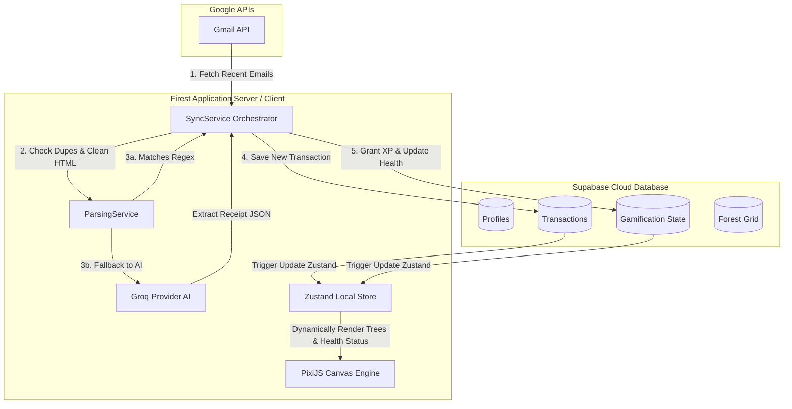

# 🌳 Firest — Gamified Financial Goals & Budget Tracker

[](https://nextjs.org/)
[](https://react.dev/)
[](https://tailwindcss.com/)
[](https://supabase.com/)
[](https://groq.com/)
[](https://pixijs.com/)

**Firest** (Financial Forest) adalah aplikasi manajemen keuangan interaktif dan tergamifikasi (*gamified personal finance tracker*) yang dirancang khusus untuk membantu mengelola anggaran bulanan dan mencapai tujuan finansial secara disiplin. 

Aplikasi ini menghubungkan kedisiplinan keuangan di dunia nyata dengan pertumbuhan sebuah hutan virtual interaktif. Jika Anda disiplin menjaga anggaran bulanan, pohon-pohon di hutan virtual Anda akan tumbuh subur dan berevolusi. Sebaliknya, jika Anda melakukan pemborosan (*overspending*), hutan Anda akan layu dan mengering.

---

## 🚀 Fitur Utama

### 1. 🌳 Simulasi Hutan Virtual Interaktif (PixiJS Canvas Engine - Bonsai Island)
* **Pusat Pulau Tunggal:** Menampilkan 1 pulau terapung melayang di tengah menggunakan **PixiJS v8** dengan layout Bonsai Island yang premium dan teratur.
* **Sistem Layering & Depth Sorting:** Struktur render yang presisi (`landLayer` -> `grassLayer` -> `treeLayer`) dengan hamparan rumput berayun ditiup angin serta depth sorting dinamis berdasarkan koordinat Y pohon.
* **Visual Progresif Tanpa Monotoni (Prioritas Belakang):** Pohon tumbuh secara teratur. Pohon baris belakang (`Belakang-Kiri` di Level 6 dan `Belakang-Kanan` di Level 7) diutamakan tumbuh lebih awal agar berukuran lebih besar dan terlihat jelas di belakang pohon tengah utama. Pohon baris depan (`Depan-Kiri` di Level 8 dan `Depan-Kanan` di Level 9) tumbuh belakangan sehingga berukuran lebih pendek dan tidak menghalangi baris belakang.
* **Logika Hutan Kering Gradual Bersyarat:**
  * **Single Tree Stage (Level < 6):** Pohon tengah utama hanya akan mengering jika kesehatan (`forestHealth`) turun di bawah 30% untuk menjaga motivasi awal.
  * **Ecosystem Stage (Level >= 6):** Mengaktifkan pengeringan bertahap dari baris depan yang paling terlihat (Depan-Kanan di health < 100%, Depan-Kiri di health < 80%, dst) hingga seluruh pohon mengering di bawah 20%.

### 2. 🎯 Fokus Anggaran "North Star Goal"
* **Satu Tujuan Utama:** Mengalihkan fokus dari banyak tujuan finansial yang berserakan menjadi satu tujuan tabungan utama (*North Star Savings Goal*). Hal ini terbukti secara psikologis membantu meningkatkan motivasi dan kejelasan arah menabung.
* **Progress Tracking Premium:** UI yang intuitif untuk memantau sisa target tabungan secara terperinci dengan tema premium yang bersih dan berkelas.
* **Dream Completion & Rewards:** Saat tabungan terkumpul memenuhi target, pengguna dapat menyelesaikan & mengklaim impian. Dilengkapi dengan animasi kartu emas berkilau, kelebihan saldo otomatis terakumulasi ke impian berikutnya, serta memberi hadiah **+200 XP** dan memulihkan kesehatan hutan menjadi **100%**.

### 3. 💳 Siklus Anggaran Aktif (Premium Green Themes)
* **Custom Target Bulanan:** Tentukan target pemasukan bulanan, target tabungan, dan tanggal mulai siklus anggaran baru (1–31).
* **Visualisasi Alokasi Kas:** Halaman utama melacak akumulasi pengeluaran bulanan terhadap batas sisa kas secara dinamis.

### 4. 📬 Sinkronisasi Otomatis Notifikasi Bank via Gmail API & Keamanan
* **Decoupled Auth (DB Gembok):** Memisahkan otorisasi login SSO dengan scope Gmail. Fitur sinkronisasi otomatis Gmail hanya terbuka untuk pengguna yang terdaftar sebagai tester (`is_gmail_tester = true`) di database untuk menghindari error 403 Google non-verified app. Pengguna non-tester akan melihat gembok dan opsi meminta akses WhatsApp.
* **Background OAuth Auto-Refresh:** Token Google OAuth disimpan langsung di database (`gmail_access_token`, `gmail_refresh_token`, `gmail_token_expires_at`). Server Next.js akan mendeteksi masa kedaluwarsa token dan memperbaruinya secara otomatis di latar belakang demi sinkronisasi permanen harian yang lancar tanpa perlu login ulang.
* **Zero-Noise Cleaner & Pre-Filtering:** Mengubah HTML email menjadi teks bersih dan melakukan pencocokan regex lokal untuk transaksi bank sebelum dikirim ke AI.

### 5. 🤖 Groq AI Receipt Extractor & Personal Advisor (Llama-3.3)
* **Receipt Extractor:** Menggunakan model **Llama-3.3-70b-versatile** via Groq Cloud API dengan format respons JSON terdefinisi untuk membedah data struk atau email notifikasi bank yang tidak didukung regex lokal secara instan.
* **AI Financial Advisor ("Fira"):** Memberikan 3 analisis finansial mingguan ("weekly review") yang dipersonalisasi, menggunakan bahasa Gen-Z Indonesia yang natural, dan memberikan rekomendasi serta tantangan nyata. Fitur ini dilengkapi sistem *caching database* untuk mencegah pemanggilan berlebih serta bebas dari cooldown jika pembuatan insight gagal.

### 6. ⚔️ Sistem Gamifikasi & Streaks
* **XP & Leveling System:** Kumpulkan poin pengalaman (XP) di setiap pencatatan transaksi (+50 XP untuk Pemasukan, +5 XP untuk Pengeluaran) hingga level maksimal 12.
* **Daily Streaks & Streak Shield:** Melacak konsistensi aktivitas harian. Dilengkapi dengan *Streak Shield* (Pelindung Streak) untuk melindungi streak Anda dari kealpaan dalam sehari.

---

## 🏗️ Arsitektur Sistem & Alur Kerja

Berikut adalah diagram alur bagaimana **Firest** menghubungkan Gmail, Gemini AI, Database, dan PixiJS Canvas:



---

## 🗄️ Desain Skema Database (Supabase / PostgreSQL)

Firest menggunakan **Supabase PostgreSQL** sebagai pondasi data. Semua tabel dilengkapi dengan aturan keamanan ketat menggunakan **Row Level Security (RLS)** untuk memastikan privasi data antar-pengguna.

### Hubungan Tabel (Relationship ERD)

```mermaid
erDiagram
    profiles {
        uuid id PK "auth.users"
        text email UNIQUE
        text full_name
        text avatar_url
        boolean is_gmail_connected
        text gmail_access_token
        text gmail_refresh_token
        timestamp gmail_token_expires_at
        boolean is_gmail_tester
        numeric monthly_income_target
        numeric monthly_savings_target
        integer budget_reset_date
        timestamp created_at
    }
    transactions {
        uuid id PK
        uuid user_id FK "profiles.id"
        text type "income/expense"
        text category
        numeric amount
        text title
        timestamp date
        boolean is_auto_sync
        text gmail_message_id UNIQUE
        text receipt_image_url
    }
    gamification_state {
        uuid user_id PK, FK "profiles.id"
        integer level
        integer xp
        integer forest_health
        integer current_streak
        integer streak_shield
    }
    forest_grid {
        uuid id PK
        uuid user_id FK "profiles.id"
        integer grid_x
        integer grid_y
        text item_type
        text status "healthy/dry"
    }
    goals {
        uuid id PK
        uuid user_id UNIQUE, FK "profiles.id"
        text name
        numeric target
        numeric current
        text color
        timestamp created_at
    }
    insights {
        uuid id PK
        uuid user_id FK "profiles.id"
        jsonb content
        timestamp created_at
    }
    notifications {
        uuid id PK
        uuid user_id FK "auth.users.id"
        text type
        text title
        text content
        boolean is_read
        timestamp created_at
    }

    profiles ||--o{ transactions : "has many"
    profiles ||--|| gamification_state : "has one"
    profiles ||--o{ forest_grid : "places tiles on"
    profiles ||--|| goals : "defines single"
    profiles ||--o{ insights : "receives"
    profiles ||--o{ notifications : "receives"
```

---

## 📂 Struktur Folder Proyek

```text
firest/
├── public/                 # Static Assets (Sprites Pohon, Ikon, Ilustrasi)
├── supabase/
│   ├── migrations/         # Berkas Migrasi SQL (Schema, Triggers, RLS Policies)
│   └── config.toml         # Konfigurasi Lokal Supabase CLI
└── src/
    ├── app/                # Next.js App Router Pages & API Routes
    │   ├── actions/        # Server Actions
    │   ├── api/            # Backend API Routing (e.g. Gmail Sync API)
    │   ├── auth/           # OAuth Callback Auth Routing & Client Sync
    │   ├── dashboard/      # Main Application Dashboard
    │   └── globals.css     # Global Styles & Setup CSS Tailwind v4
    ├── components/
    │   ├── dashboard/      # Dashboard Panel Widgets (Budget, Goals, Insights, Transactions)
    │   └── game/           # PixiJS Canvas Renderer (PixiCanvas.tsx)
    ├── services/           # Logika Bisnis (Sync & Parsing Services)
    ├── store/              # State Management Global (Zustand - useAppStore.ts)
    └── utils/
        ├── ai/             # Gemini API Integration Provider
        ├── db/             # Database Helper Services
        ├── gmail/          # Gmail Email Fetchers & Cleaners
        └── supabase/       # Supabase Client & Server Configurations
```

---

## 🛠️ Panduan Instalasi & Setup Lokal

Ikuti langkah-langkah di bawah ini untuk menjalankan **Firest** di lingkungan lokal Anda:

### 1. Prasyarat
* Pasang **Node.js** (versi 18 ke atas disarankan).
* Pastikan Anda memiliki akun **Google Cloud Console** (untuk mendapatkan OAuth2 API Credentials guna sinkronisasi Gmail).
* Pastikan Anda memiliki akun **Supabase** (atau menggunakan local Supabase CLI docker).
* Dapatkan API Key dari **Google AI Studio** (untuk akses Gemini API).

### 2. Kloning Proyek & Pasang Dependensi
```bash
git clone https://github.com/username/firest.git
cd firest
npm install
```

### 3. Konfigurasi Variabel Lingkungan (`.env.local`)
Buat berkas `.env.local` pada direktori utama proyek Anda dan lengkapi variabel berikut:

```env
# Supabase Configuration
NEXT_PUBLIC_SUPABASE_URL=https://your-supabase-project-id.supabase.co
NEXT_PUBLIC_SUPABASE_ANON_KEY=your-supabase-anon-key

# Groq AI API Key (Llama 3.3 Engine)
GROQ_API_KEY=your-groq-api-key

# Google Client OAuth2 Credentials (Gmail API integration)
GOOGLE_CLIENT_ID=your-google-oauth2-client-id
GOOGLE_CLIENT_SECRET=your-google-oauth2-client-secret
```

### 4. Setup Database Supabase
Jalankan skrip migrasi yang berada pada folder `supabase/migrations/` pada SQL Editor Supabase Anda, atau jika menggunakan CLI lokal, jalankan perintah:

```bash
npx supabase start
```
*Catatan: Pastikan Trigger `on_auth_user_created` telah aktif agar profil baru otomatis diinisiasi dengan grid hutan virtual (`forest_grid` tile `0,0`) dan status gamifikasi awal.*

### 5. Jalankan Server Pengembangan
```bash
npm run dev
```

Buka halaman [http://localhost:3000](http://localhost:3000) pada browser Anda untuk mulai menggunakan Firest.

---

## 🧪 Skrip Pengujian

Proyek ini dilengkapi dengan **Vitest** untuk pengujian terintegrasi pada status kalkulasi game dan parsing transaksi.
Jalankan pengujian menggunakan perintah berikut:

```bash
npm run test
```

---

## 🤝 Kontribusi & Lisensi

Proyek ini dilindungi oleh Lisensi **MIT**. Kontribusi sangat kami hargai! Untuk melaporkan isu atau mengajukan pembaruan fitur, silakan buat *Pull Request* atau ajukan via *Issues* GitHub.

---

*“Tumbuhkan tabunganmu, hijaukan hutanmu bersama Firest! 🌳💰”*
